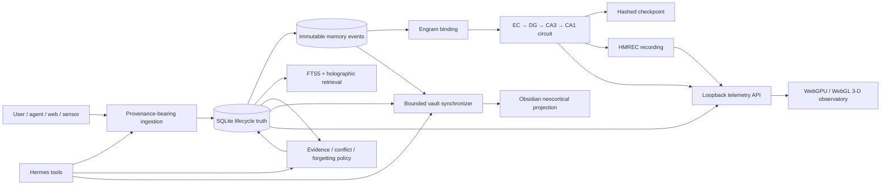

# Hippocampal Memory

### Provenance-aware temporal cognition, GPU replay, and an observable 3-D memory system

Hippocampal Memory is a standalone, local-first memory system that treats
remembering as a governed lifecycle rather than a vector lookup. It records
where knowledge came from, changes confidence as evidence accumulates, preserves
contradictions, archives obsolete knowledge before deletion, consolidates
episodes into reusable principles, and derives carefully gated identity
meta-memories.

Version 0.3 also represents temporal context and order, recency, source
monitoring, autobiographical recollection metadata, event segmentation,
context reinstatement, guarded reconsolidation, and simulated EC/CA1 time-cell
sequences.

The package combines five cooperating systems:

- an authoritative SQLite lifecycle store;
- an append-only event and synchronization ledger;
- a human-readable Obsidian neocortical projection;
- a 36,864-neuron GPU spiking circuit for local replay; and
- a live WebGPU/WebGL observatory for inspecting neural activity in 3-D.

It is independent of Hermes Agent. A thin optional plugin gives Hermes nine
native memory tools without moving the lifecycle implementation into the Hermes
repository.

> **Maturity:** version 0.3.0 is an alpha research system. Its lifecycle,
> migration, replay, and observability contracts are tested, but the neural
> circuit is an engineering model inspired by hippocampal organization—not a
> claim of biological equivalence.

## System at a glance

| Surface | Implemented contract |
|---|---|
| Provenance | `user`, `agent`, `web`, `reflection`, `sensor`, `system`, and imported sources; reference, URI, actor, timestamp, and payload hash |
| Confidence | Bounded `[0,1]` score updated by weighted confirmation and contradiction evidence |
| Memory kinds | Episode, fact, principle, and identity |
| Conflict handling | Both memories retained, linked, marked conflicted, and excluded from consolidation |
| Forgetting | Deterministic archive-first rules with pinning, grace periods, supersession lineage, and restoration |
| Consolidation | Evidence-gated principle and identity formation with derivation links |
| Coordination | Immutable events, per-aggregate revisions, idempotency, optimistic concurrency, and SHA-256 integrity |
| Obsidian | Concept-centric notes, preserved human annotations, bounded transactional writes, rollback journals, and full-vault repair |
| Neural circuit | 36,864 LIF neurons and 770,048 sparse synapses across EC→DG→CA3→CA1 |
| Plasticity | Local STDP, bounded weights, homeostatic thresholds, refractory periods, and local inhibition |
| Sleep | Exclusive-GPU encoding, NREM ripple/spindle replay, REM associative replay, foreground preemption, recordings, and hashed checkpoints |
| Observatory | Loopback-only API, binary WebSocket telemetry, live/recorded 3-D rendering, LOD, filtering, inspection, and replay scrubbing |
| Agent integration | Five Hermes tools plus a desktop Obsidian observatory adapter |

## Architecture



SQLite is authoritative for lifecycle state. Obsidian is the inspectable,
human-editable projection. Neural state is a third local projection linked by
engram IDs and checkpoint hashes. The observatory can read summaries and
telemetry, but it has no endpoint capable of changing memory lifecycle state.

Every cross-layer transition remains attributable:

```text
source → memory state → immutable event revision
       → engram binding → neural checkpoint/recording
       → vault sync ledger → Obsidian note
```

See [Architecture](docs/ARCHITECTURE.md) for ownership boundaries, data tables,
write ordering, and failure behavior.

## Why this is more than retrieval

### Evidence changes belief

For prior confidence `c` and evidence weight `w`:

```text
confirmation:  c′ = c + (1 − c) × 0.15 × w
contradiction: c′ = c − c × 0.25 × w
```

Scores are clamped to `[0,1]`. Source-only observations establish lineage
without changing confidence. Re-observing identical content is recorded as
confirmation rather than silently deduplicated.

### Abstraction requires enough evidence

| Derived memory | Support | Independent sources | Mean confidence | Time span | Other gates |
|---|---:|---:|---:|---:|---|
| Principle | ≥3 | ≥2 | ≥0.70 | — | contradiction ratio <0.20; no open conflicts |
| Identity | ≥5 | ≥3 | ≥0.80 | ≥7 days | contradiction ratio <0.20; no open conflicts |

Model output is only a proposal. Deterministic policy applies these gates before
acceptance. Full policy is documented in
[Memory lifecycle](docs/MEMORY_LIFECYCLE.md).

### Forgetting is reversible

Forgetting means retrieval suppression through archival, not immediate erasure.
Pinned memories are protected. Automated maintenance archives only explicit
classes: expired memories, completed consolidation sources after their grace
period, stale unused low-value episodes, and repeatedly contradicted
low-confidence memories with no open conflict. Supersession requires matching
subject/predicate keys and a replacement source at least as strong as the old
one.

## Neural consolidation

The default RTX 5060 Ti profile contains:

| Region | Neurons | Role in this engineering model |
|---|---:|---|
| Entorhinal cortex (EC) | 8,192 | deterministic sparse input cues |
| Dentate gyrus (DG) | 16,384 | expanded pattern separation |
| CA3 | 8,192 | recurrent completion and replay |
| CA1 | 4,096 | convergent output |
| **Total** | **36,864** | |

Six excitatory pathways provide 327,680 synapses. Four local inhibitory fields
provide 442,368 more, for **770,048 sparse synapses** in total.

The circuit advances at a 1 ms step with leaky integrate-and-fire dynamics,
2 ms refractory periods, spike traces, asymmetric STDP, bounded weights, and
homeostatic threshold adaptation. NREM replay nests brief cue packets inside a
slower spindle envelope. REM uses weaker distributed cues and lower
neuromodulation. External language models may select replay candidates, but
cannot author synaptic weights.

See [Neural consolidation](docs/NEURAL_CONSOLIDATION.md) for the exact topology,
dynamics, replay schedule, GPU arbitration, and biological analogy limits.

## Live 3-D observatory

The local viewer renders all 36,864 neuron positions and uses region-level
clusters at distant zoom. It supports:

- WebGPU with WebGL2 fallback;
- orbit, pan, zoom, and keyboard free-flight;
- live active-neuron and active-synapse overlays;
- inhibitory-field filtering and region activity counts;
- neuron/engram selection and provenance inspection;
- a bounded 600-frame live backlog; and
- local `.hmrec` playback with timeline scrubbing.

Run the telemetry service and viewer:

```powershell
.\.venv-neural\Scripts\hippocampal-memory observatory
Set-Location viewer
npm ci
npm run dev
```

Open [http://localhost:3000](http://localhost:3000).

The telemetry service binds only to loopback. Its publisher endpoint requires a
local bearer token; viewer lifecycle data is read-only. See
[Observability](docs/OBSERVABILITY.md).

## Installation

Core lifecycle:

```powershell
python -m venv .venv
.\.venv\Scripts\python -m pip install -e ".[dev]"
```

RTX neural and observatory environment:

```powershell
python -m venv .venv-neural
.\.venv-neural\Scripts\python -m pip install `
  "torch==2.12.1+cu130" --index-url https://download.pytorch.org/whl/cu130
.\.venv-neural\Scripts\python -m pip install `
  -e ".[holographic,obsidian,observatory,dev]"
```

Validate the production circuit contract:

```powershell
.\.venv-neural\Scripts\hippocampal-memory circuit-check --device cuda
```

See [Operations](docs/OPERATIONS.md) for the complete CLI, Windows scheduled
tasks, default paths, verification procedures, and recovery behavior.

## Minimal lifecycle use

```python
from hippocampal_memory import MemoryStore

store = MemoryStore("memory.db")
memory_id = store.add_fact(
    "Large refactors benefit from hierarchical planning.",
    memory_kind="principle",
    provenance_type="reflection",
    provenance_ref="run:42",
    confidence=0.80,
    subject_key="large refactors",
    predicate_key="benefit from hierarchical planning",
)

store.record_evidence(
    memory_id,
    "confirm",
    provenance_type="user",
    provenance_ref="session:later",
    weight=0.9,
)
```

## Obsidian and Hermes

Obsidian notes carry lifecycle frontmatter, a regenerated managed block, and an
untouched `## Human notes` section. Synchronization plans are dry-run by
default, capped at 25 writes, protected by pre-write hashes, applied through
atomic replacement, and recorded in rollback journals.

```powershell
hippocampal-memory vault-plan --vault C:\Hermes\Knowledge
hippocampal-memory vault-sync --vault C:\Hermes\Knowledge --limit 25 --apply
```

The Hermes adapter registers:

- `hippocampal_remember`
- `hippocampal_query`
- `hippocampal_evidence`
- `hippocampal_archive`
- `hippocampal_vault_sync`

The desktop Obsidian adapter embeds the same loopback observatory without
granting it vault-write authority. Full contracts and migration behavior are in
[Integrations](docs/INTEGRATIONS.md).

## Documentation

| Document | Contents |
|---|---|
| [Architecture](docs/ARCHITECTURE.md) | authority boundaries, data model, events, transactions, retrieval |
| [Memory lifecycle](docs/MEMORY_LIFECYCLE.md) | provenance, confidence equations, evidence gates, conflict, consolidation, forgetting |
| [Neural consolidation](docs/NEURAL_CONSOLIDATION.md) | topology, dynamics, plasticity, sleep replay, checkpoints, GPU preemption |
| [Cognitive mechanisms](docs/COGNITIVE_MECHANISMS.md) | temporal/source/autobiographical constructs, segmentation, reinstatement, reconsolidation, time cells |
| [Observability](docs/OBSERVABILITY.md) | telemetry API, WebSocket/frame schemas, recording format, 3-D viewer |
| [Integrations](docs/INTEGRATIONS.md) | Obsidian projection/migration and Hermes tool contracts |
| [Operations](docs/OPERATIONS.md) | installation, CLI, scheduled tasks, validation, recovery, troubleshooting |
| [Security](SECURITY.md) | trust boundaries, local-only guarantees, limits, and reporting |
| [Contributing](CONTRIBUTING.md) | development environments and required validation |
| [Changelog](CHANGELOG.md) | release-level capability history |

## Privacy and safety posture

Runtime memories, transcripts, SQLite databases, vault content, recordings,
checkpoints, logs, credentials, model files, and local configuration are not
part of this repository. The package redacts secret-shaped replay input, excludes
tool payloads and hidden reasoning, bounds context and telemetry sizes, refuses
non-loopback observatory binding, and archives before deleting.

This is a local research architecture, not a medical model of memory or a
security boundary for untrusted multi-tenant workloads.

## Origin and license

The initial lifecycle/replay implementation was extracted from an MIT-licensed
Hermes Agent integration. The standalone architecture is maintained
independently. The original Nous Research copyright remains in
[LICENSE](LICENSE).
