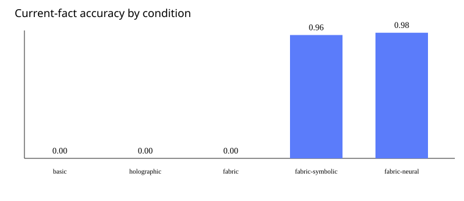

# v0.5 Evaluation Report

Protocol: `eval-v0.5-protocol-1`

## Results

| Condition | Accuracy | Source | Stale use | Poison | p95 latency (ms) |
|---|---:|---:|---:|---:|---:|
| basic | 0.000 | 0.000 | 0.000 | 0.000 | 0.000 |
| holographic | 0.000 | 0.000 | 0.000 | 0.000 | 0.000 |
| fabric | 0.000 | 0.000 | 0.000 | 0.000 | 0.000 |
| fabric-symbolic | 0.964 | 0.964 | 0.000 | 0.000 | 95.270 |
| fabric-neural | 0.982 | 0.982 | 0.000 | 0.000 | 130.138 |

## Preregistered claims

- CI smoke results are not eligible as publication evidence.

## Reproducibility

- Git commit: `0af02062ce88e6ad2bfdeb0665ad8e17814f1015`
- Dirty worktree: `True`
- Trials SHA-256: `684731ad97975f2eef4e835f53cfb0ce6276c75ab18a0d153d45e99fdc43a344`

These claims apply only to the recorded datasets, models, and hardware.
