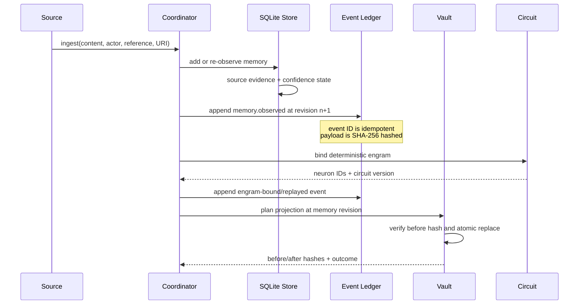
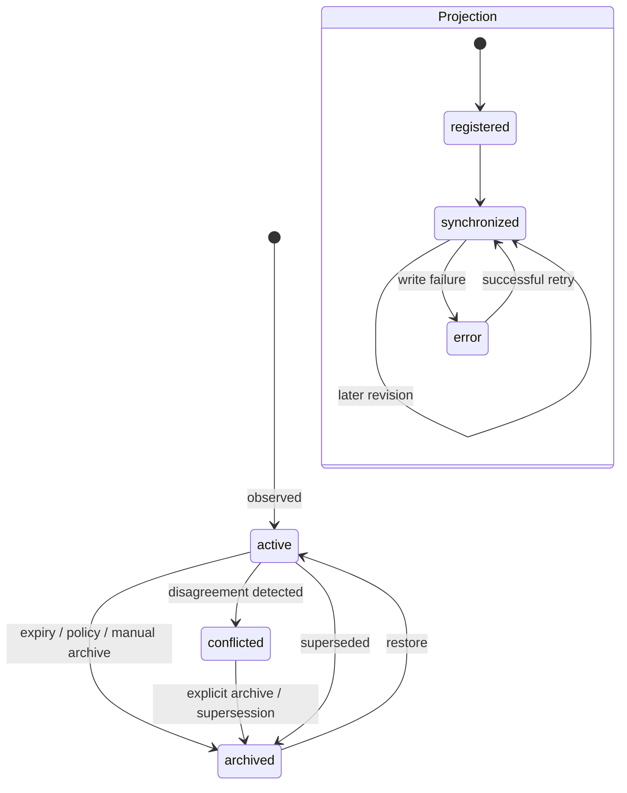

# Architecture

## Design objective

Cognitive Memory Fabric separates factual lifecycle truth, human-readable knowledge,
and neural replay state. No projection is allowed to silently become the
authority for another.

The core invariants are:

1. Every durable memory has provenance and bounded confidence.
2. Contradictory observations coexist until explicitly resolved.
3. Forgetting is archival and reversible.
4. Consolidated knowledge retains derivation links to its sources.
5. Cross-layer writes have immutable events or synchronization ledger entries.
6. Neural weights change only through local circuit rules.
7. Vault writes are bounded, journaled, and safe against concurrent edits.
8. The observatory can inspect lifecycle state but cannot mutate it.
9. Temporal order is explicit rather than inferred from row insertion.
10. Retrieval-induced lability is gated, time-bounded, and version-preserving.
11. Operational self-recollection metadata never implies consciousness.
12. Neural query inference is frozen, candidate-bounded, and fails closed to
    symbolic retrieval.

## Authority boundaries

| Layer | Authority | It does not own |
|---|---|---|
| `MemoryStore` / SQLite | current lifecycle state, evidence, confidence, conflicts, derivations, retrieval counters | human annotations or synaptic state |
| `MemoryCoordinator` | immutable integration events, revisions, vault registry, sync ledger, engram/checkpoint registry | the semantic truth of a memory |
| Obsidian projection | human-readable notes and user-authored `Human notes` | confidence, status, archival decisions, or event history |
| Neural circuit | voltage, spikes, traces, thresholds, weights, geometry | memory text, evidence policy, or lifecycle status |
| Observatory | visualization and bounded provenance summaries | any lifecycle write |
| Hermes provider | bounded automatic recall and agent-facing commands that invoke core policy | independent storage or policy |

## Write path

`MemoryCoordinator.append_event()` enforces one monotonically increasing
revision per aggregate. An optional expected revision implements optimistic
concurrency. Repeating the same event ID with identical identity and payload is
idempotent; reusing it for different content fails with `RevisionConflict`.

## Current-state tables

The lifecycle store uses SQLite with WAL when supported and portable rollback
journaling as fallback.

| Table | Purpose |
|---|---|
| `facts` | content, kind, status, confidence, provenance, temporal validity, retrieval value, pinning, and supersession |
| `fact_evidence` | source, confirm, and contradict observations with source references and weights |
| `fact_conflicts` | open/resolved disagreement links between two retained memories |
| `fact_derivations` | lineage from a principle or identity memory to source episodes/facts |
| `entities`, `fact_entities` | extracted entity index |
| `facts_fts` | FTS5 lexical retrieval |
| `memory_banks` | optional bundled holographic category vectors |
| `hippocampus_sessions` | replay checkpoints by source session |
| `hippocampus_runs` | replay-run accounting |
| `memory_decisions` | accepted/rejected policy decisions and their reasons |
| `hippocampus_control` | pause/control state |
| `temporal_contexts`, `episodic_events`, `event_memories` | temporal context and event segmentation |
| `temporal_bindings` | explicit order, elapsed time, and confidence |
| `source_monitoring_assessments` | inspectable source-attribution evaluation |
| `reconsolidation_windows`, `memory_versions` | guarded lability and before/after state |
| `context_reinstatements` | audited context retrieval |

The `facts` table is migrated in place to add lifecycle fields such as
`memory_kind`, provenance, confirmation/contradiction counts, subject/predicate
keys, validity windows, relevance/salience/source quality, `pinned`,
`superseded_by`, archive reason, review date, and restore date.

## Integration tables

| Table | Purpose |
|---|---|
| `memory_events` | append-only, attributed, revisioned, payload-hashed events |
| `vault_registry` | stable memory→note identity/path and last synchronized revision/hash |
| `sync_ledger` | direction, revisions, before/after hashes, outcome, and detail |
| `engram_bindings` | memory→engram identity, content/circuit version, neuron and CA1 signature IDs, strength, replay count |
| `neural_checkpoints` | circuit version, phase, path, SHA-256, event revision, and metadata |
| `time_cell_bindings` | memory/context/sequence to simulated EC/CA1 temporal assembly |

Event payloads use deterministic compact JSON before hashing. Events include
actor type/reference, source URI, causation ID, correlation ID, UTC occurrence
time, schema version, aggregate ID, event type, and revision.

## Read path

Hermes prefetch obtains at most 50 candidates from the symbolic retriever,
applies lifecycle exclusion and trust, and injects at most 10 entries or 8,000
characters. In symbolic-replay mode, replay strength may rerank that pool. In
neural mode, a content-derived EC cue produces a plasticity-disabled CA1
response, which is compared with persisted candidate signatures. A two-second
deadline or missing/incompatible checkpoint returns the symbolic ordering and
records a fallback.

Returned content carries provenance, confidence, validity, status, and
supersession metadata inside an untrusted-evidence boundary.

## Memory and projection states

Archived rows remain queryable with `include_archived=True`. Restoration clears
the archive fields, records `restored_at`, and protects the memory from immediate
maintenance review. Version 0.2 records open conflicts but does not expose a
standalone public conflict-resolution method; resolution must be an explicit
host policy rather than an implicit overwrite.

## Retrieval

Retrieval is deliberately separable from lifecycle policy:

- FTS5 provides lexical ranking.
- Confidence, status, and category constrain results.
- Optional holographic reduced representations encode words and facts as
  4,096-dimensional phase vectors for associative similarity. At the warning
  threshold of one item per four dimensions, a category bank can hold roughly
  1,024 active items before its estimated signal-to-noise ratio falls below 2.
- Retrieval/use feedback adjusts confidence by small bounded deltas.
- Archived memories are excluded unless explicitly requested.

Retrieval does not create truth. Evidence and policy change lifecycle state.

## Failure behavior

- SQLite writes occur under a shared re-entrant lock.
- Event revision mismatches fail rather than overwriting newer work.
- Vault plans fail closed above their write limit.
- Vault targets are containment-checked beneath the selected root.
- Concurrent note edits are detected by comparing the planned pre-write hash.
- Each note is written to a same-directory temporary file and atomically
  replaced.
- Applied writes have backups and a manifest; a mid-batch exception rolls back
  previously applied mutations.
- Neural recordings are authoritative when no live viewer is available.
- GPU replay can stop between circuit steps when foreground work appears.
- Time-cell sequences expose simulated elapsed phase and context remapping.
- Malformed extraction output defers only the affected source session with a
  persisted retry time; it does not block later sessions.
- Malformed abstraction output preserves completed ingestion and records a
  warning so the next governed run can retry consolidation.

## Extensibility

The lifecycle package can be embedded without Hermes, Obsidian, PyTorch, or the
viewer. Optional dependencies are split into `holographic`, `obsidian`,
`neural`, `observatory`, `hermes`, and `dev` extras. A host agent needs only a
compatible transcript source or direct calls to `MemoryStore` and
`MemoryCoordinator`.

See [Cognitive and temporal mechanisms](COGNITIVE_MECHANISMS.md) for behavioral
contracts and biological boundaries.
